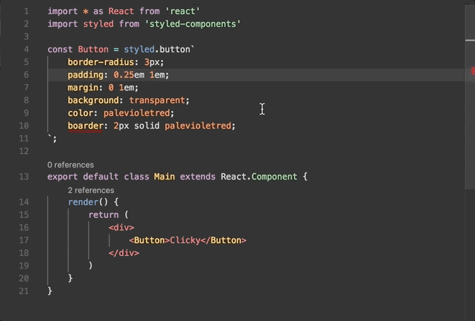

# TypeScript Styled Plugin

Cross-editor TypeScript Server plugin for CSS IntelliSense in [styled-components](https://styled-components.com) template literals.




## Features

- IntelliSense for CSS property names and values.
- Syntax error reporting.
- Quick fixes for misspelled property names.

## Requirements

- TypeScript 6.x.
- Node.js 22.12.0 or newer in the tsserver host.
- Synchronous `require(ESM)` support. The ESM plugin module graph must not use top-level `await`.

The automated suite covers the standard Node.js tsserver path. An editor must
use a compatible tsserver host and runtime; successful installation alone does
not prove editor compatibility.

## Quick Start

Install the plugin alongside the workspace TypeScript SDK:

```bash
npm install --save-dev @styled/typescript-styled-plugin typescript@^6.0.3
```

```json
{
  "compilerOptions": {
    "plugins": [
      {
        "name": "@styled/typescript-styled-plugin"
      }
    ]
  }
}
```

Configure the editor to use this workspace TypeScript SDK. See the
[usage guide](docs/usage.md) for tag configuration, validation and lint
properties, and Emmet completions.

## Editor Integration

### With VS Code

This setup path requires validation against the specific VS Code and workspace
TypeScript versions in use.

Install the [VS Code Styled Components extension](https://github.com/styled-components/vscode-styled-components) for syntax highlighting and styled-components support. Then run `Select TypeScript Version` and select the workspace version after completing the [Quick Start](#quick-start).

For details on using a workspace TypeScript version, see the [VS Code TypeScript documentation](https://code.visualstudio.com/docs/typescript/typescript-compiling#_using-newer-typescript-versions).

### With Sublime Text

This setup path requires validation against the Sublime TypeScript plugin and
its bundled Node runtime. Configure the plugin to use the workspace TypeScript
SDK after completing the [Quick Start](#quick-start). Its Node runtime must meet
the requirements above.

### With Visual Studio

This setup path requires validation against the installed Visual Studio
TypeScript Server host and runtime. Complete the [Quick Start](#quick-start) in
the project, then confirm Visual Studio loads the workspace TypeScript SDK. Its
tsserver host must meet the requirements above; older bundled Node runtimes
cannot load this ESM-only package.

## Maintainers

See the [maintenance guide](docs/maintenance.md) for local setup, scripts,
testing, performance baselines, package validation, and pull request guidance.

## Credits

Originally forked from [Quramy/ts-graphql-plugin](https://github.com/Quramy/ts-graphql-plugin).
